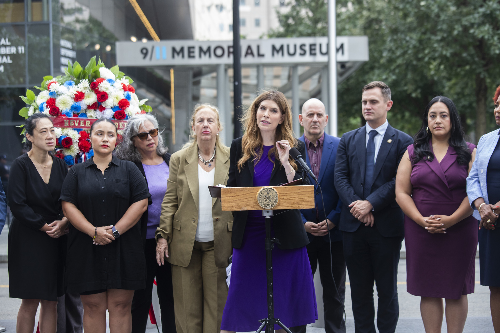
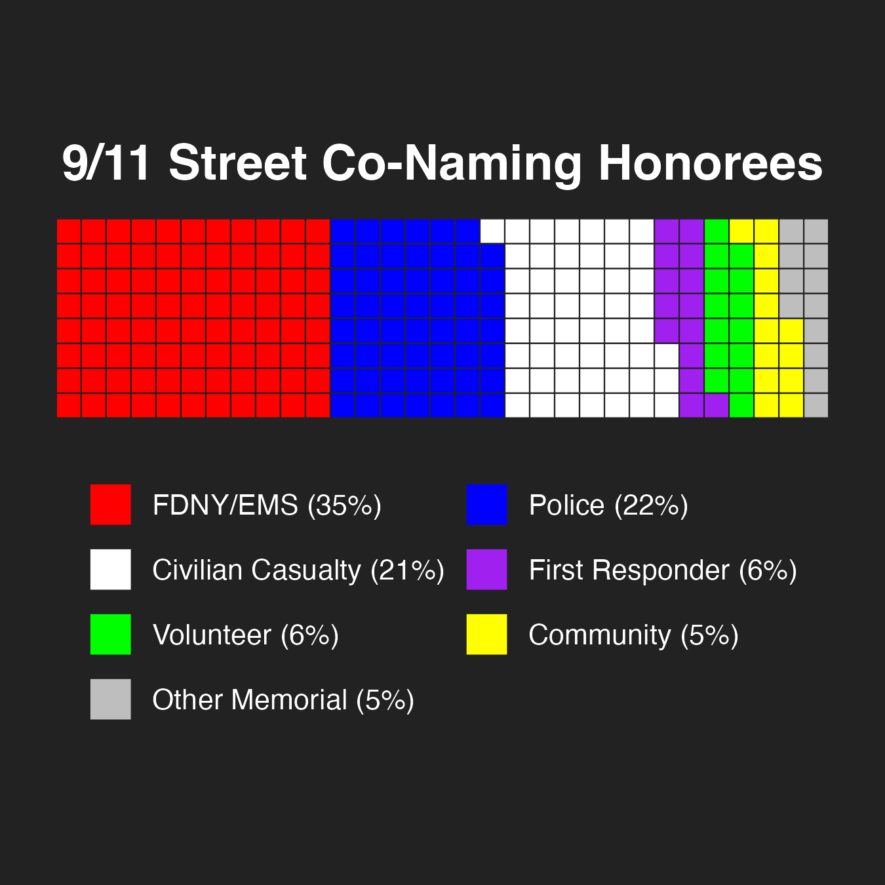
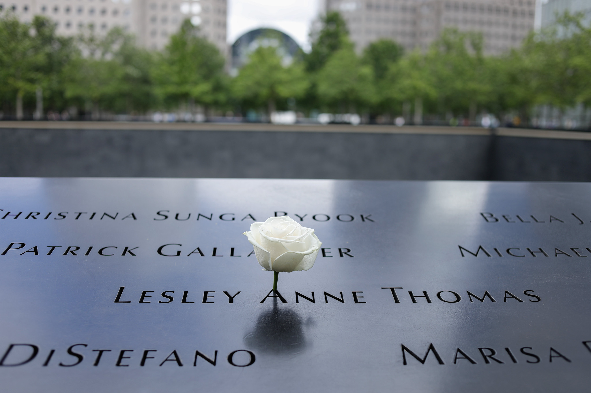

```{r setup, include=FALSE}
knitr::opts_chunk$set(
  echo = FALSE,
  warning = FALSE,
  message = FALSE
)
```

September 11, 2001 was unforgettable for every New Yorker in the city that day - changing many of their lives forever. So many of our family, friends, neighbors, finest, bravest, and best lost their lives that morning at the World Trade Center. We have continued to lose many more in the years since to impacts and illnesses related to 9/11.
 
Now, a quarter century later, over 30% of the City's population was either born in the years since, or is too young to directly remember the experience. Yet, as we reflect on the past, it is also an opportunity to ensure that future generations will learn not only about the tremendous loss the City experienced but also about the many stories of heroism, compassion, and New Yorkers coming together.
 
For the past 25 years the New York City Council has told those stories by honoring and recognizing individuals whose lives were lost due to 9/11 with street co-naming signs. These are honorary secondary signs, placed alongside the official street sign, and required to be kept there by local law. Yet, our local communities have also been telling these stories - through memorials, candlelight vigils, walk/runs, and other remembrance events. These events are held by schools, by civic organizations, by houses of worship, by firehouses, by first responder groups, by charities, by museums, and sometimes just by groups of neighbors coming together. Each is unique, and they have become an important part of our City's cultural fabric. Now, for this 25th anniversary, the City Council is expanding the stories we are telling by recognizing over two dozen of these memorials though street co-naming signs. For generations to come, New Yorkers will see these street signs and know that these are the places where we came together to remember, to reflect, and to heal.
 
We are also passing two Resolutions, both commemorating 9/11 and calling on the State to incorporate a 9/11 curriculum in all New York schools.
 
If you want to learn some of these stories yourself, please explore the map below and click on individual street co-naming signs.

# Legislation
{.resolution-image}

[Res 0006-2026:](https://legistar.council.nyc.gov/LegislationDetail.aspx?ID=7861347&GUID=3BE44CB0-F375-4872-B663-99B534885B0B) Resolution commemorating the 25th anniversary of the September 11 attacks.

[Res 0007-2026:](https://legistar.council.nyc.gov/LegislationDetail.aspx?ID=7861348&GUID=8E5F3235-234C-4FAA-88C5-B717FD7DA7F7) Resolution calling on the New York State Legislature to pass, and the Governor to sign, legislation to incorporate a 9/11 curriculum in all New York schools.

[Preconsidered Int. ___-2026:](https://legistar.council.nyc.gov/LegislationDetail.aspx?ID=8199396&GUID=2551620E-B7BC-4D31-B0C5-1830C3A8019D) A Local Law in relation to the naming of 26 thoroughfares and public places to commemorate the 25th anniversary of 9/11.

# 9/11 Street Co-Namings in New York City

Below is a map compiled by the NYC Council Data Team, based on legislation previously passed by the City Council, as well as legislation to be voted on at the Stated meeting on September 10, 2026, showing the locations of 9/11 related street co-namings.

```{=html}
<div class="iframe-container">
  <button class="fullscreen-button" onclick="toggleFullscreen(this)">
    ⛶ Fullscreen
  </button>

  <iframe
    src="map.html"
    width="100%"
    height="750px"
    style="border:none;"
    allowfullscreen>
  </iframe>
</div>

<script>
function toggleFullscreen(button) {
  const iframe = button.parentElement.querySelector("iframe");

  if (!document.fullscreenElement) {
    iframe.requestFullscreen();
  } else {
    document.exitFullscreen();
  }
}
</script>
```

Street co-namings were sourced from the [NYC Honorary Street Names Map](https://streetnamesmap-nyc.hub.arcgis.com/) and filtered to include those with relevant mentions of 9/11 and related terms. The City Council Member listed in the "Council Member" field is the person who represented the district containing the co-named street at the time the co-naming was adopted. If biographical information was not available through the Honorary Street Names Map, it was sourced from [this index of honorary street names](http://www.nycstreets.info) or an online obituary cited in the popup.  

The Data Team categorized the objects on the map according to the people they commemorate. FDNY/EMS represents members of the Fire Department, Police represents NYPD and all other police officers, First Responder represents all other responders in the line of duty, Volunteer represents civilian responders, Civilian Casualty represents civilians targeted by the attacks, Community represents affinity groups affected by the attacks, and Other Memorial represents places that broadly commemorate 9/11.

```{=html}
<div class="plot-row">
  <div class="plot-column">
    <iframe src="docs/p_year.html"></iframe>
  </div>

  <div class="plot-column">
    
  </div>
</div>
```

```{=html}
<script>
.plot-column iframe {
  width: 100%;
  height: 100%;
  border: 0;
}
</script>
```

This year's package of 9/11-related street co-namings is the largest in the city's history, continuing an increasing trend that goes back to 2022. Until that year, 9/11-related co-namings had been most frequent in the 5 years following the attacks. Before this year's package, more recent co-namings often memorialized those who died of 9/11-related illness. The plurality of honorees are FDNY/EMS, with police and civilian casualties honored by large shares of memorials as well. 

The objects shown on the map are not an exhaustive collection of 9/11 commemorations across NYC. If you would like to request a 9/11 related street co-naming, you can contact your local [Council Member](https://council.nyc.gov/districts/) or [Community Board](https://www.nyc.gov/site/communityboards/index.page).

{.resolution-image}


